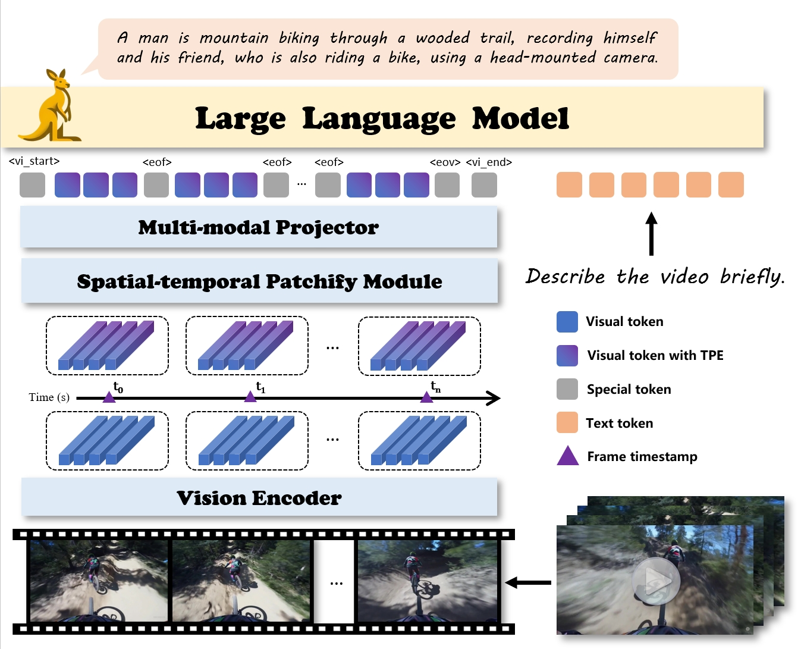
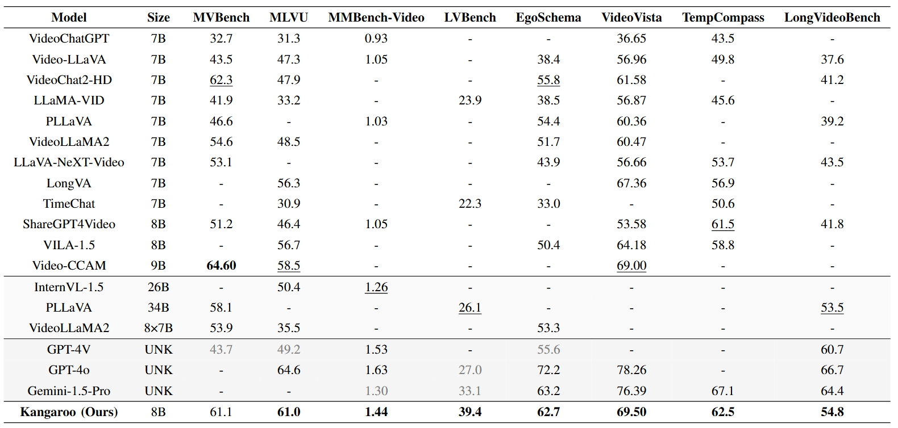

# Kangaroo: A Powerful Video-Language Model Supporting Long-context Video Input

## Release
- [2024/07/17] 🔥 **Kangaroo** has been released. We release [blog](https://kangaroogroup.github.io/Kangaroo.github.io/) and [model](https://huggingface.co/KangarooGroup/kangaroo). Please check out the blog for details.

## Abstract
We introduce <strong>Kangaroo</strong>, a powerful Multimodal Large Language Model designed for long-context video understanding. Our presented Kangaroo model shows remarkable performance across diverse video understanding tasks including video caption, QA and conversation. Generally, our key contributions in this work can be summarized as follows:
<ol>
    <li><strong>Long-context Video Input.</strong> To enhance the model's capability to comprehend longer videos, we extend the maximum frames of input videos to 160. To this end, we aggregate multiple videos with variable frame counts and aspect ratios into one sample. We further design a spatial-temporal pathify module to improve training efficiency.</li>
    <li><strong>Strong Performance.</strong> We evaluate our model across various video understanding benchmarks. The results indicate that our model achieves state-of-the-art performance on the majority of comprehensive benchmarks and maintain a competitive level in others. Notably, our model outperforms most larger open-source models with over 30B parameters and some proprietary models on certain benchmarks.</li>
    <li><strong>Video Annotation System.</strong> We develop a data curation and automatic annotation system to generate captions for open-source and internal videos. The generated large-scale dataset are utilized for video-text pre-training. For video instruction tuning stage, we construct a video instruciton tuning dataset based on public and internal datasets covering a variety of tasks.</li>
    <li><strong>Billingual Conversation.</strong> Our proposed model is equipped with the capability of Chinese, English and billingual conversations, and support single/multi-round conversation paradigms.
    </li>
</ol>

## Model
<p align="center">
    
</p>

## Quick Start

### Installation
```bash
conda create -n kangaroo python=3.9 -y
conda activate llava
pip install -r requirements
```

#### Make Sure the following are installed
- python == 3.9
- torch == 2.1.1, torchvision == 0.16.1
- CUDA == 12.1
- timm == 0.9.16
- flash-attn == 2.6.1
- transformers == 4.41.0
- xformers == 0.0.23

### Download Model
Our Kangaroo model checkpoint is available at [huggingface](https://huggingface.co/KangarooGroup/kangaroo).
```bash
huggingface-cli download  --resume-download KangarooGroup/kangaroo --local-dir kangaroo_model
```

### Multi-round Chat with 🤗 Transformers
See [chat.ipynb](https://github.com/KangarooGroup/Kangaroo/blob/main/chat.ipynb)

## Results

### Results on Comprehensive Video Understanding Benchmarks
<p align="center">
    
</p>

### Qualitative Examples
<p align="center">
    
</p>
<p align="center">
    
</p>

## Citation

If you find it useful for your research , please cite related papers/blogs using this BibTeX:
```bibtex

@misc{kangaroogroup,
	title={Kangaroo: A Powerful Video-Language Model Supporting Long-context Video Input},
	url={https://kangaroogroup.github.io/Kangaroo.github.io/},
	author={Jiajun Liu and Yibing Wang and Hanghang Ma and Xiaoping Wu and Xiaoqi Ma and Jie Hu},
	month={July},
	year={2024}
}
