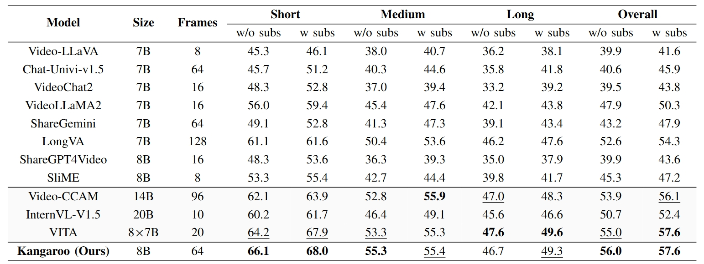
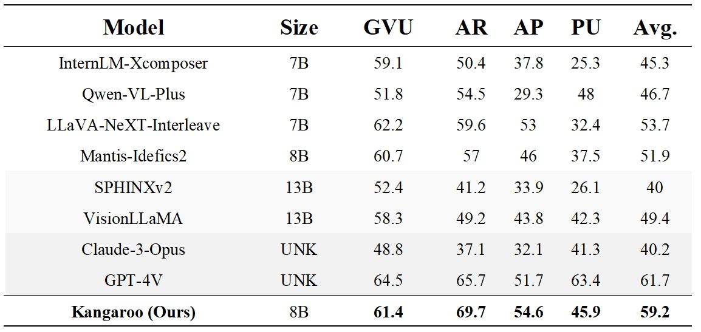
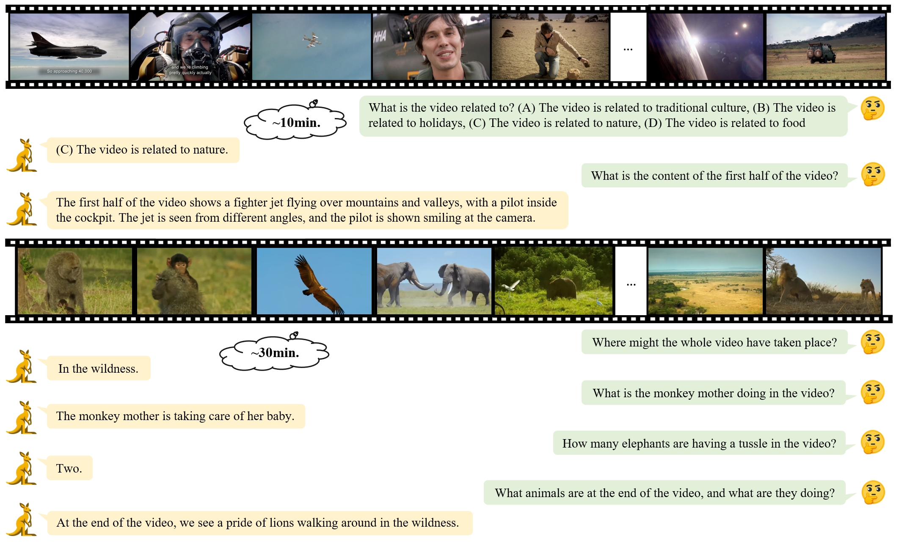

# Kangaroo: A Powerful Video-Language Model Supporting Long-context Video Input

## Release
- [2024/08/29] 🔥 We release our [paper](https://arxiv.org/pdf/2408.15542) on Arkiv. 
- [2024/08/5] 🔥 We submit evalution results of LongVideoBench(test split). Our **Kangaroo** model achieves better results than existing open-source methods.
- [2024/07/24] 🔥 We submit evalution results of VideoVista benchmark on the online [leaderboard](https://videovista.github.io/#leaderboard). Our **Kangaroo** model achieves SOTA performance among open-source models.
- [2024/07/23] 🔥 We submit evalution results of Video-MME benchmark on the online [leaderboard](https://video-mme.github.io/home_page.html#leaderboard). Our **Kangaroo** model outperforms other 7B/8B models, and surpasses most models with over 10B parameters.
- [2024/07/17] 🔥 **Kangaroo** has been released. We release [blog](https://kangaroogroup.github.io/Kangaroo.github.io/) and [model](https://huggingface.co/KangarooGroup/kangaroo). Please check out the blog for details.

## Abstract
Rapid advancements have been made in extending Large Language Models (LLMs) to Large Multi-modal Models (LMMs). However, extending input modality of LLMs to video data remains a challenging endeavor, especially for long videos. Due to insufficient access to large-scale high-quality video data and the excessive compression of visual features, current methods exhibit limitations in effectively processing long videos. In this paper, we introduce Kangaroo, a powerful Video LMM aimed at addressing these challenges. Confronted with issue of inadequate training data, we develop a data curation system to build a large-scale dataset with high-quality annotations for visionlanguage pre-training and instruction tuning. In addition, we design a curriculum training pipeline with gradually increasing resolution and number of input frames to accommodate long videos. Evaluation results demonstrate that, with 8B parameters, Kangaroo achieves state-of-the-art performance across a variety of video understanding benchmarks while exhibiting competitive results on others. Particularly, on benchmarks specialized for long videos, Kangaroo excels some larger models with over 10B parameters and proprietary models.

## Highlights
- Large-scale Data Curation. We develop a data curation system to generate captions for open-source and internal videos and construct a video instruction tuning dataset covering a variety of tasks.
- Long-context Video Input. We extend the maximum frames of input videos to 160, with corresponding sequence length up to 22k tokens.
- Superior Performance. Our model achieves state-of-the-art performance on the a variety of comprehensive benchmarks and outperforms some larger open-source models with over 10B parameters and proprietary models on certain benchmarks.
- Bilingual Conversation. Our model is equipped with the capability of Chinese, English and bilingual conversations, and support single/multi-round conversation paradigms.

## Model
<p align="center">
    
</p>

## Quick Start

### Installation
1. Prepare environment
```bash
conda create -n kangaroo python=3.9 -y
conda activate kangaroo
pip install -r requirements
```
2. Install flash-attn
```bash
pip install flash-attn --no-build-isolation
```
3. Install nvidia apex according to [apex](https://github.com/NVIDIA/apex)

### Multi-round Chat with 🤗 Transformers
See [chat.ipynb](https://github.com/KangarooGroup/Kangaroo/blob/main/chat.ipynb)

### Streamlit Deploy
We provide code for users to build a web UI demo. Please use ```streamlit==1.36.0```.
```
streamlit run streamlit_app.py --server.port PORT
```
## Results

### Evaluation Results
<p align="center">
    
</p>

#### Results on VideoMME
<p align="center">
    
</p>

#### Results on SeedBench-Video
<p align="center">
    
</p>

### Qualitative Examples
<p align="center">
    
</p>
<p align="center">
    
</p>
<p align="center">
    
</p>

## Citation

If you find it useful for your research , please cite related papers/blogs using this BibTeX:
```bibtex

@article{kangaroogroup,
	title={Kangaroo: A Powerful Video-Language Model Supporting Long-context Video Input},
	author={Liu, Jiajun and Wang, Yibing and Ma, Hanghang and Wu, Xiaoping and Ma, Xiaoqi and Wei, xiaoming and Jiao, Jianbin and Wu, Enhua and Hu, Jie},
    journal={arXiv preprint arXiv:2408.15542},
	year={2024}
}
